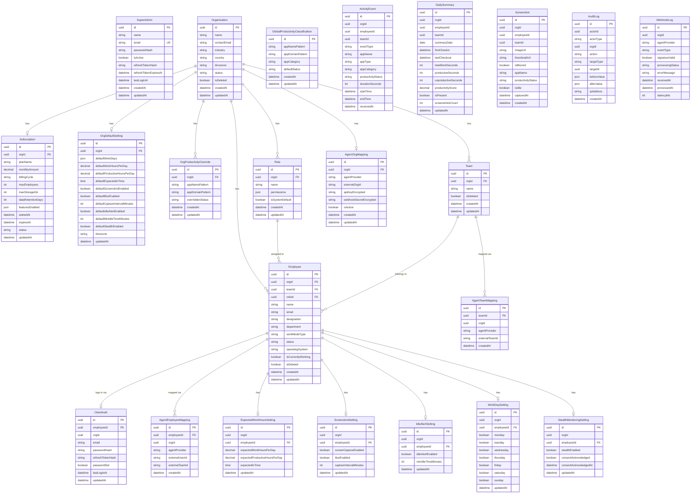

# SoniQ — Database Schema ERD

```mermaid
erDiagram

    SuperAdmin {
        uuid id PK
        string name
        string email UK
        string passwordHash
        boolean isActive
        string refreshTokenHash
        datetime refreshTokenExpiresAt
        datetime lastLoginAt
        datetime createdAt
        datetime updatedAt
    }

    Organization {
        uuid id PK
        string name
        string contactEmail
        string industry
        string country
        string timezone
        string status
        boolean isDeleted
        datetime createdAt
        datetime updatedAt
    }

    Subscription {
        uuid id PK
        uuid orgId FK
        string planName
        decimal monthlyAmount
        string billingCycle
        int maxEmployees
        int maxStorageGb
        int dataRetentionDays
        json featuresEnabled
        datetime startedAt
        datetime expiresAt
        string status
        datetime updatedAt
    }

    OrgDefaultSetting {
        uuid id PK
        uuid orgId FK
        json defaultWorkDays
        decimal defaultWorkHoursPerDay
        decimal defaultProductiveHoursPerDay
        time defaultExpectedInTime
        boolean defaultScreenshotEnabled
        boolean defaultBlurEnabled
        int defaultCaptureIntervalMinutes
        boolean defaultIdleAlertEnabled
        int defaultMinIdleTimeMinutes
        boolean defaultStealthEnabled
        string timezone
        datetime updatedAt
    }

    OrgProductivityOverride {
        uuid id PK
        uuid orgId FK
        string appNamePattern
        string appDomainPattern
        string overriddenStatus
        datetime createdAt
        datetime updatedAt
    }

    GlobalProductivityClassification {
        uuid id PK
        string appNamePattern
        string appDomainPattern
        string appCategory
        string defaultStatus
        datetime createdAt
        datetime updatedAt
    }

    Role {
        uuid id PK
        uuid orgId FK
        string name
        json permissions
        boolean isSystemDefault
        datetime createdAt
        datetime updatedAt
    }

    Team {
        uuid id PK
        uuid orgId FK
        string name
        boolean isDeleted
        datetime createdAt
        datetime updatedAt
    }

    Employee {
        uuid id PK
        uuid orgId FK
        uuid teamId FK
        uuid roleId FK
        string name
        string email
        string designation
        string department
        string workModeType
        string status
        string operatingSystem
        boolean isCurrentlyWorking
        boolean isDeleted
        datetime createdAt
        datetime updatedAt
    }

    ClientAuth {
        uuid id PK
        uuid employeeId FK
        uuid orgId
        string email
        string passwordHash
        string refreshTokenHash
        boolean passwordSet
        datetime lastLoginAt
        datetime updatedAt
    }

    AgentOrgMapping {
        uuid id PK
        uuid orgId FK
        string agentProvider
        string externalOrgId
        string apiKeyEncrypted
        string webhookSecretEncrypted
        boolean isActive
        datetime createdAt
        datetime updatedAt
    }

    AgentTeamMapping {
        uuid id PK
        uuid teamId FK
        uuid orgId
        string agentProvider
        string externalTeamId
        datetime createdAt
    }

    AgentEmployeeMapping {
        uuid id PK
        uuid employeeId FK
        uuid orgId
        string agentProvider
        string externalUserId
        string externalTeamId
        datetime createdAt
    }

    ActivityEvent {
        uuid id PK
        uuid orgId
        uuid employeeId
        uuid teamId
        string eventType
        string appName
        string appType
        string appCategory
        string productivityStatus
        int durationSeconds
        datetime startTime
        datetime endTime
        datetime receivedAt
    }

    DailySummary {
        uuid id PK
        uuid orgId
        uuid employeeId
        uuid teamId
        date summaryDate
        datetime firstCheckin
        datetime lastCheckout
        int totalWorkSeconds
        int productiveSeconds
        int unproductiveSeconds
        decimal productivityScore
        boolean isPresent
        int screenshotsCount
        datetime updatedAt
    }

    Screenshot {
        uuid id PK
        uuid orgId
        uuid employeeId
        uuid teamId
        string imageUrl
        string thumbnailUrl
        boolean isBlurred
        string appName
        string productivityStatus
        boolean isIdle
        datetime capturedAt
        datetime createdAt
    }

    ExpectedWorkHoursSetting {
        uuid id PK
        uuid orgId
        uuid employeeId FK
        decimal expectedWorkHoursPerDay
        decimal expectedProductiveHoursPerDay
        time expectedInTime
        datetime updatedAt
    }

    ScreenshotSetting {
        uuid id PK
        uuid orgId
        uuid employeeId FK
        boolean screenCaptureEnabled
        boolean blurEnabled
        int captureIntervalMinutes
        datetime updatedAt
    }

    IdleAlertSetting {
        uuid id PK
        uuid orgId
        uuid employeeId FK
        boolean idleAlertEnabled
        int minIdleTimeMinutes
        datetime updatedAt
    }

    WorkDaySetting {
        uuid id PK
        uuid orgId
        uuid employeeId FK
        boolean monday
        boolean tuesday
        boolean wednesday
        boolean thursday
        boolean friday
        boolean saturday
        boolean sunday
        datetime updatedAt
    }

    StealthMonitoringSetting {
        uuid id PK
        uuid orgId
        uuid employeeId FK
        boolean stealthEnabled
        boolean consentAcknowledged
        datetime consentAcknowledgedAt
        datetime updatedAt
    }

    AuditLog {
        uuid id PK
        uuid actorId
        string actorType
        uuid orgId
        string action
        string targetType
        uuid targetId
        json beforeValue
        json afterValue
        string ipAddress
        datetime createdAt
    }

    WebhookLog {
        uuid id PK
        uuid orgId
        string agentProvider
        string eventType
        boolean signatureValid
        string processingStatus
        string errorMessage
        datetime receivedAt
        datetime processedAt
        int latencyMs
    }

    %% ── Relationships ──────────────────────────────────────────────────────

    Organization ||--o| Subscription          : "has"
    Organization ||--o| OrgDefaultSetting     : "has"
    Organization ||--o| AgentOrgMapping       : "has"
    Organization ||--o{ OrgProductivityOverride : "has"
    Organization ||--o{ Role                  : "has"
    Organization ||--o{ Team                  : "has"
    Organization ||--o{ Employee              : "has"

    Role         ||--o{ Employee              : "assigned to"
    Team         ||--o{ Employee              : "belongs to"
    Team         ||--o{ AgentTeamMapping      : "mapped via"

    Employee     ||--o| ClientAuth            : "logs in via"
    Employee     ||--o{ AgentEmployeeMapping  : "mapped via"
    Employee     ||--o| ExpectedWorkHoursSetting  : "has"
    Employee     ||--o| ScreenshotSetting         : "has"
    Employee     ||--o| IdleAlertSetting           : "has"
    Employee     ||--o| WorkDaySetting             : "has"
    Employee     ||--o| StealthMonitoringSetting   : "has"
```
